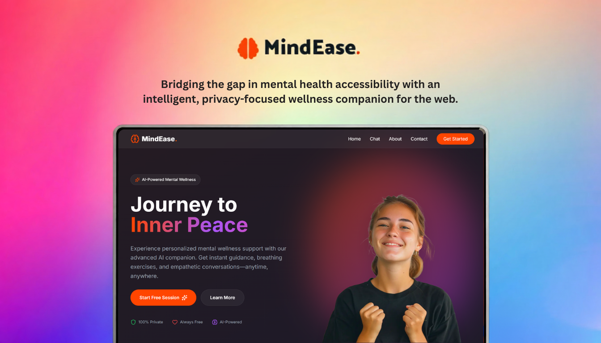

<div align="center">


[](https://twitter.com/intent/follow?screen_name=DeriaRanit)
[](https://www.linkedin.com/in/ranit-deria-916864257/)

  <br />
   
  <br />

  <h2 align="center">MindEase - Your Empathetic AI Mental Wellness Companion</h2>

  <p align="center">
    MindEase is an intelligent mental wellness platform that combines AI-powered conversations with dynamic sentiment analysis and interactive breathing exercises. Built with Next.js 14 and powered by Llama 3, it provides a safe, judgment-free space for emotional support while maintaining complete privacy through a stateless architecture.
  </p>

  <a href="https://mindeaze.vercel.app/"><strong>➥ Live Demo</strong></a>

  <br />
  <br />

  

</div>

<br />

## Table of Contents

- [Overview](#overview)
- [Prerequisites](#prerequisites)
- [Technologies Utilized](#technologies-utilized)
- [Features](#features)
- [Run Locally](#run-locally)
- [Deployment](#deployment)
- [Configuration](#configuration)
- [Project Structure](#project-structure)
- [Privacy & Security](#privacy--security)
- [Crisis Support](#crisis-support)
- [License](#license)
- [Contact](#contact)

## Overview

Mental wellness is crucial, yet many hesitate to seek support due to stigma or accessibility barriers. **MindEase** bridges this gap by offering:

- **24/7 AI-powered emotional support** through context-aware conversations
- **Real-time sentiment analysis** that adapts the interface to your emotional state
- **Interactive wellness tools** including guided breathing exercises
- **Complete privacy** with zero data retention architecture
- **Immediate crisis support** with integrated Indian helpline resources

### Prerequisites: <a name="prerequisites"></a>

Before setting up MindEase, ensure you have the following installed and configured:

- **[Node.js](https://nodejs.org/)** (v18.x or later)
- **[npm](https://www.npmjs.com/)** or **[pnpm](https://pnpm.io/)** (package manager)
- **[Git](https://git-scm.com/)** (for version control)
- **API Keys** (see [Configuration](#configuration) section)

### Technologies Utilized: <a name="technologies-utilized"></a>

- **Framework:**  Next.js 14 (App Router)
- **Language:**  TypeScript

- **Styling:**  Tailwind CSS

- **Animations:**  Framer Motion

- **AI Engine:**  Groq SDK (Llama 3)

- **Icons:**  Lucide React

- **Speech Recognition:**  Web Speech API

- **Form Handling:**  Web3Forms


### Features: <a name="features"></a>

- **🤖 Empathetic AI Companion:** Context-aware conversations powered by Llama 3 that understand and respond to emotional nuances.
- **🎨 Dynamic Sentiment Analysis:** Real-time mood detection with UI color adaptation (Blue/Orange/Green) based on user emotions.
- **🧘 Serenity Breath Mode:** Interactive guided breathing exercises with visual cues and optional haptic feedback.
- **🎤 Voice-to-Vent:** Seamless speech-to-text input for natural, hands-free conversations.
- **🔒 Privacy by Design:** Stateless architecture with zero data retention—your conversations are never stored.
- **🆘 Crisis Intervention:** Quick access to Indian mental health helplines including Tele-MANAS (14416) and National Emergency (112).
- **📱 Responsive Design:** Fully optimized experience across all devices.
- **♿ Accessibility First:** WCAG compliant with keyboard navigation and screen reader support.

### Run Locally: <a name="run-locally"></a>

To run **MindEase** on your local machine, follow these steps:

1. **Clone the Repository:**

   ```bash
   git clone https://github.com/RanitDERIA/mindease.git
   cd mindease
   ```

2. **Install Dependencies:**

   ```bash
   npm install
   ```

   or

   ```bash
   pnpm install
   ```

3. **Environment Setup:** Create a `.env.local` file in the root directory and add your API keys:

   ```env
   # Groq AI Configuration
   GROQ_API_KEY=your_groq_api_key_here
   
   # Web3Forms Configuration (for contact form)
   NEXT_PUBLIC_WEB3FORMS_ACCESS_KEY=your_web3forms_key_here
   ```

4. **Start the Development Server:**

   ```bash
   npm run dev
   ```

5. **Open Your Browser:** Navigate to http://localhost:3000 to see the application running.

### Deployment: <a name="deployment"></a>

The application is optimized for deployment on **Vercel**, leveraging Next.js's native integration.

**Deploy to Vercel:**

1. Push your code to a GitHub repository.
2. Connect your repository to Vercel.
3. Configure environment variables in the Vercel project dashboard:
   - `GROQ_API_KEY`
   - `NEXT_PUBLIC_WEB3FORMS_ACCESS_KEY`
4. Deploy! Vercel will automatically build and deploy your application.

**Alternative Platforms:** MindEase can be deployed to any platform supporting Next.js (Netlify, Railway, DigitalOcean, etc.).

### Configuration: <a name="configuration"></a>

**Required API Keys:**

- **Groq API Key:** Sign up at [Groq Cloud](https://console.groq.com/) to access Llama 3 models for AI conversations.
- **Web3Forms Access Key:** Create a free account at [Web3Forms](https://web3forms.com/) for contact form functionality.

### Project Structure: <a name="project-structure"></a>

```
mindease/
├── app/                        # Next.js App Router directory
│   ├── about/                  # About page
│   ├── api/                    # API routes
│   │   └── chat/               # AI chat endpoint
│   ├── chat/                   # Main chat interface page
│   ├── components/             # React components
│   │   ├── ChatInterface.tsx   # Main chat UI component
│   │   ├── ChatWidget.tsx      # IBM Watson chatbot widget
│   │   ├── Features.tsx        # Features showcase section
│   │   ├── Footer.tsx          # Global footer
│   │   ├── Hero.tsx            # Landing page hero
│   │   ├── Navbar.tsx          # Global navigation
│   │   ├── SentimentIndicator.tsx  # Emotion visualization
│   │   ├── SerenityBreath.tsx  # Breathing exercise component
│   │   └── VoiceInput.tsx      # Speech recognition interface
│   ├── contact/                # Contact page
│   ├── hooks/                  # Custom React hooks
│   │   └── useSpeechRecognition.ts  # Voice input hook
│   ├── privacy/                # Privacy policy page
│   ├── terms/                  # Terms of service page
│   ├── globals.css             # Global styles
│   ├── layout.tsx              # Root layout component
│   └── page.tsx                # Landing page
├── public/                     # Static assets
├── readme-assets/              # Documentation images
├── .gitignore                  # Git ignore configuration
├── next.config.ts              # Next.js configuration
├── package.json                # Dependencies and scripts
├── tailwind.config.ts          # Tailwind CSS configuration
└── tsconfig.json               # TypeScript configuration
```

### Privacy & Security: <a name="privacy--security"></a>

MindEase is built with privacy as a core principle:

- **Zero Data Retention:** Conversations are processed in real-time and never stored on servers.
- **Stateless Architecture:** No user tracking, cookies, or persistent sessions.
- **Secure API Calls:** All AI interactions use encrypted HTTPS connections.
- **Local Processing:** Sentiment analysis and speech recognition happen client-side when possible.
- **No Account Required:** Use MindEase anonymously without signup or login.

**Note:** While MindEase prioritizes privacy, please review our [Privacy Policy](https://mindeaze.vercel.app/privacy) and [Terms of Service](https://mindeaze.vercel.app/terms) before use.

### Crisis Support: <a name="crisis-support"></a>

MindEase provides immediate access to professional mental health resources:

**Indian Mental Health Helplines:**

- **Tele-MANAS:** 14416 (National Mental Health Helpline)
- **National Emergency:** 112
- **AASRA:** 9820466726 (24/7 Suicide Prevention)
- **Vandrevala Foundation:** 1860-2662-345 / 1800-2333-330

**Important:** MindEase is a supportive tool and not a replacement for professional mental health care. If you're experiencing a mental health crisis, please contact emergency services or a mental health professional immediately.

### License: <a name="license"></a>

This project is licensed under the **MIT License** - see the [LICENSE](https://github.com/RanitDERIA/mindease/blob/main/LICENSE.md) file for details.

### Contact: <a name="contact"></a>

If you want to get in touch or have any questions regarding this project, feel free to reach out:

📧 **Email:** bytebardderia@gmail.com  
💼 **LinkedIn:** [Ranit Deria](https://www.linkedin.com/in/ranit-deria-916864257/)  
🐦 **Twitter:** [@DeriaRanit](https://twitter.com/DeriaRanit)  
💻 **GitHub:** [@RanitDERIA](https://github.com/RanitDERIA)

For any inquiries, suggestions, or bug reports, you can also:

- 🐛 Open an issue on GitHub
- 💬 Start a discussion in the repository
- 📩 Send a direct message via social media

---

<div align="center">
  
**⭐ Star this repository if you find it helpful!**

**🌟 If MindEase has helped you, consider sharing it with someone who might need support.**

Made with ❤️ by [Ranit Deria](https://profession-folio.vercel.app)

</div>